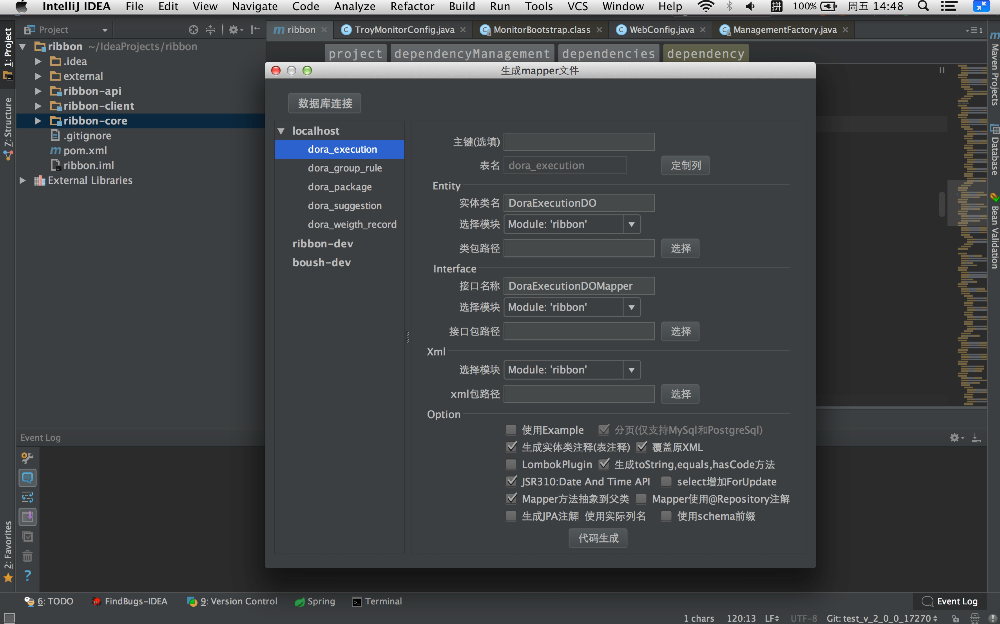
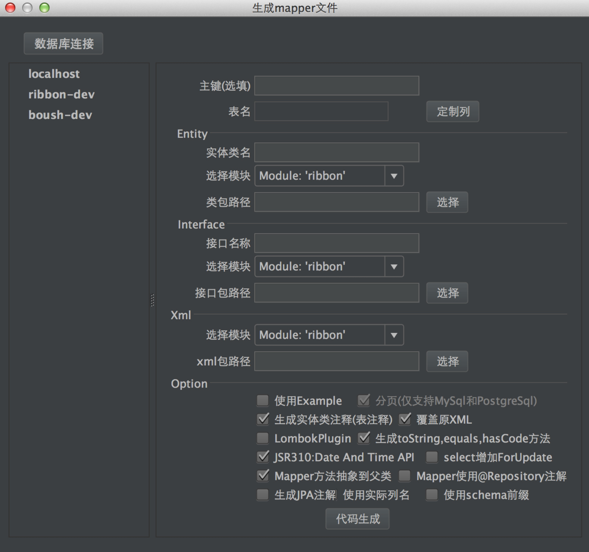
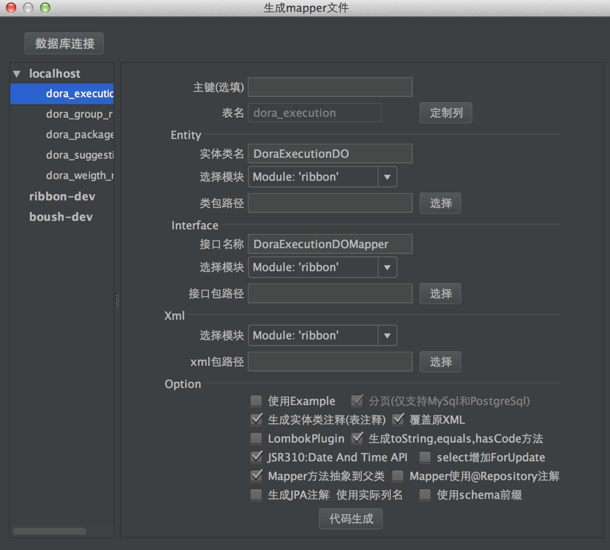

### 简介

 [mapper-generator-plugin ](https://github.com/ifetch/mapper-generator-plugin)是集成[mybatis generator](http://www.mybatis.org/generator/index.html) 而开发的一款Intellij IDEA 界面工具。只需要在你的IDEA开发工具中安装该插件，就可以使你非常容易及快速生成Mybatis的Java POJO文件及数据库Mapping文件。

( 图1)

#### 注意：

   仅支持 IDEA 开发工具

   IDEA 版本 > 2016.2.4

   本工具由于使用了Java 8的众多特性，所以要求JDK **1.8**以上版本，对于JDK版本还没有升级的童鞋表示歉意。

### 核心特性

- 保存数据库链接信息，配置一次数据库信息永久保存
- 界面化省去学习generator plugin 的过程
- 按照界面步骤输入和选择，省去手动配置 table config 和generator config 
- 内置常用插件 mysql limit offset plugin, 生成toString,equals ,hashCode  plugin, lombok plugin
- 支持java 8 jsr310: data and time api
- 可选的去除掉对版本管理不友好的注释，这样新增或删除字段重新生成的文件比较过来清楚
- 目前已经支持Mysql、Oracle、PostgreSQL与SQL Server，暂不对其他非主流数据库提供支持。

### 下载地址

  点击[mapper-generator-plugin.zip](https://github.com/ifetch/mapper-generator-plugin/releases)下载 

   

### 安装

windows: Settings ->左边菜单栏 选择 Plugins -> 右边选择 Installed  -> 选择 mapper-generator-plugin.zip

mac: Preferences -> 左边菜单栏 选择 Plugins -> 右边选择 Install Plugin from disk －> 选择 mapper-generator-plugin.zip

重启IDEA 安装完成

### 运行

​        安装完成后 选择顶部菜单栏->Tools ->  Mapper Generator…     显示如 图2

(图2)

#### 使用手册

 ##### 第一步: 链接数据库

1. 点击 “数据库连接” 添加你的数据
2. 点击保存，保存数据连接

##### 第二步: 建立数据库连接

1. 双击左侧的数据库-> 会展示 该数据库下所有的表名

2. 选择你所需要生成的表双击 -> 表相关信息会填充到 右边表单中  显示如图3

   

​        (图3)

##### 第三步:  完善右边表单中相关信息

 entity

1. 自定义java pojo 文件名称
2. 选择 pojo文件 存放的module
3. 选择java pojo文件 存放的目录(可自定义,目录不存在会自动创建)

interface

1. 自定义mapper interface 文件名称
2. 选择mapper interface 文件存放的 module
3. 选择mapper interface 文件存放的目录 (可自定义,目录不存在会自动创建)

xml

1. 选择 xml 存放的module
2. 选择xml 文件存放的目录(可自定义,目录不存在会自动创建) 

option

1. 选择你所需要的插件
2. JSR310: Date And Time API 是将数据库中 表字段 datetime类型 转成java 8 的LocalDateTime
3. 其他可按自己需求选择
4. 点击代码生成 ，可去上面选择的目录 中查看对应的 pojo ,interface,xml

